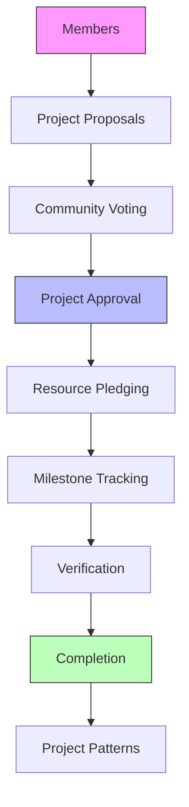

# Community Sustainability Network

A decentralized platform enabling local communities to propose, fund, and collaborate on sustainability projects using transparent, blockchain-based governance.

## Overview

The Community Sustainability Network (CSN) creates infrastructure for communities to work together on environmental initiatives through:

- Transparent project proposals and voting
- Resource pledging (time, materials, skills, funds)
- Milestone tracking and verification
- Reputation-based participation
- Knowledge sharing through project patterns

The platform empowers communities to take direct action on sustainability while ensuring accountability and democratic decision-making.

## Architecture

The CSN is built on a single core smart contract that manages all key functionality:



Core components:
- Member registration and reputation system
- Project lifecycle management
- Democratic voting mechanisms
- Resource pledging system
- Milestone tracking and verification
- Knowledge capture through project patterns

## Contract Documentation

### eco-network.clar

The main contract managing all platform functionality.

#### Key Data Structures

- `members` - Stores member profiles and reputation
- `projects` - Tracks project details and status
- `pledges` - Records resource commitments
- `milestones` - Manages project milestones
- `project-patterns` - Stores reusable project templates

#### Project Statuses

- `STATUS-PROPOSED` (1)
- `STATUS-APPROVED` (2) 
- `STATUS-IN-PROGRESS` (3)
- `STATUS-COMPLETED` (4)
- `STATUS-CANCELLED` (5)

#### Resource Types

- `RESOURCE-TIME` (1)
- `RESOURCE-MATERIALS` (2)
- `RESOURCE-SKILLS` (3)
- `RESOURCE-FUNDS` (4)

## Getting Started

### Prerequisites

- [Clarinet](https://github.com/hirosystems/clarinet)
- [Stacks Wallet](https://www.hiro.so/wallet)

### Basic Usage

1. Register as a member:
```clarity
(contract-call? .eco-network register-member "John Doe" (list "solar" "gardening"))
```

2. Create a project:
```clarity
(contract-call? .eco-network create-project 
    "Community Garden" 
    "Create sustainable garden" 
    "Reduces food miles" 
    u5)
```

3. Vote on a project:
```clarity
(contract-call? .eco-network vote-on-project u1)
```

4. Pledge resources:
```clarity
(contract-call? .eco-network pledge-resources 
    u1 
    RESOURCE-TIME 
    "Weekly maintenance" 
    u10)
```

## Function Reference

### Member Management

```clarity
(register-member (name (string-ascii 50)) (skills (list 10 (string-ascii 50))))
(update-member-profile (name (string-ascii 50)) (skills (list 10 (string-ascii 50))))
```

### Project Management

```clarity
(create-project (title (string-ascii 100)) 
               (description (string-utf8 500))
               (environmental-impact (string-utf8 500))
               (required-votes uint))

(add-project-milestone (project-id uint) 
                      (description (string-utf8 200))
                      (deadline uint))

(complete-project (project-id uint))
(cancel-project (project-id uint))
```

### Resource Management

```clarity
(pledge-resources (project-id uint) 
                 (resource-type uint)
                 (description (string-utf8 200))
                 (amount uint))

(fulfill-pledge (project-id uint) (resource-type uint))
```

## Development

### Testing

1. Clone the repository
2. Install Clarinet
3. Run tests:
```bash
clarinet test
```

### Local Development

1. Start Clarinet console:
```bash
clarinet console
```

2. Deploy contract:
```bash
clarinet deploy
```

## Security Considerations

### Permissions
- Only registered members can participate
- Reputation requirements for key actions
- Project creators have special permissions
- Community voting required for major decisions

### Limitations
- No direct token transfers
- Fixed resource types
- Manual verification required
- Simplified governance parameters

### Best Practices
- Verify project status before interactions
- Check reputation requirements
- Monitor milestone deadlines
- Review all pledges before project approval